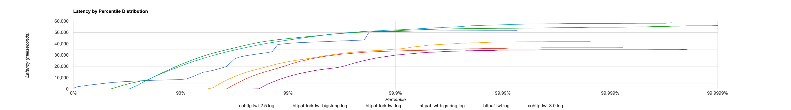

# Benchmark HTTP

Benchmark of different HTTP servers in OCaml

## Setup your development environment

We pin several packages, so the easiest way to setup you environment is to use the lock file.

```bash
make switch
```

This will create a new local opam switch from the lock file

## Install wrk

We use wrk2 to generate the benchmark.

If you're on macOS, you can install wrk2 with:

```
brew tap jabley/homebrew-wrk2
brew install --HEAD wrk2
```

## Run the benchmarks

To run a benchmark, start the HTTP server that you want to benchmark:

```
opam exec -- dune exec bin/cohttp_lwt.exe
```

And in another tab, run the benchmark script:

```
sh script/run.sh
```

## Results

The results of the benchmarks can be found in `result/`.

Here's a plot of the historgram with all of them.



It has been generated with [hdrhistogram](http://hdrhistogram.github.io/HdrHistogram/plotFiles.html).
